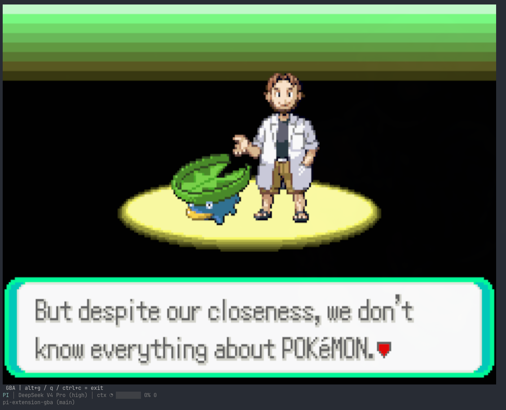
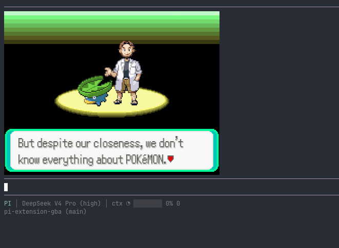
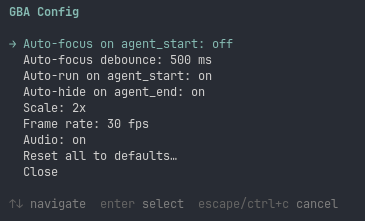

# pi-extension-gba

[](https://github.com/WSeubring/pi-extension-gba/actions/workflows/ci.yml)
[](https://www.npmjs.com/package/pi-extension-gba)

**Play Game Boy Advance games inside [pi](https://github.com/badlogic/pi-mono) — right in your terminal, while the agent works.**

When the agent is busy thinking, the game takes over your screen. The moment it
turns the conversation back to you, the chat reappears and your keystrokes go
back to the prompt. No window switching, no context loss — just Pokémon in the
gaps.



---

## Why

Agents spend real seconds working. This extension fills that dead time with a
full GBA emulator (a WebAssembly build of [mGBA](https://mgba.io)) rendered
directly in your terminal via the Kitty graphics protocol. It auto-pauses,
auto-saves, and auto-resumes around the agent's turns, so playing never
interferes with the work.

## Features

- **Full GBA emulation** — real mGBA core, save files (`.sav`) and save states (`.state`).
- **Seamless hand-off** — game shows on `agent_start`, chat returns on `agent_end`.
- **Plays in your terminal** — no separate window; rendered inline with Kitty graphics.
- **Optional audio** — opt-in, uses whatever audio tool you already have.
- **Pick up where you left off** — last ROM and state auto-resume on `/gba`.

## Requirements

- **pi** installed and working.
- **A Kitty-graphics terminal** — [Ghostty](https://ghostty.org), [Kitty](https://sw.kovidgoyal.in/kitty/), or [WezTerm](https://wezterm.org). Terminals without Kitty graphics (and bare tmux) are detected and the extension self-disables with a warning instead of printing garbage.
- **Your own `.gba` ROM files** — none are bundled. Use ROMs you legally own.
- **(Optional) an audio tool** — `pw-cat`, `pacat`, `ffplay`, or `aplay` on your `$PATH`, only if you want sound.

## Install

From npm:

```sh
pi install npm:pi-extension-gba
```

> The `npm:` prefix is required — `pi install pi-extension-gba` is interpreted as a local filesystem path, not an npm package.

From GitHub:

```sh
pi install git:github.com/WSeubring/pi-extension-gba
```

From a local checkout:

```sh
npm install && npm run build && pi install .
```

## Add a ROM

1. Drop your `.gba` files into:

   ```
   ~/.config/pi/roms/gba/
   ```

2. In pi, type `/gba` to open the game picker (or resume your last game).

That's it — pick a ROM and play.

## Playing

Type `/gba` to start. Inside the game, keys route to the emulator:

| Key            | Button       |
|----------------|--------------|
| Arrow keys     | D-pad        |
| `z`            | A            |
| `x`            | B            |
| `a`            | L            |
| `s`            | R            |
| `Enter`        | Start        |
| `Backspace`    | Select       |
| `alt+g` / `ctrl+c` | Exit game mode |

### Commands

| Command             | Effect                                                              |
|---------------------|---------------------------------------------------------------------|
| `/gba`              | Resume last-played ROM; otherwise open picker (or warn if empty).   |
| `/gba list`         | Always open the ROM picker.                                         |
| `/gba <basename>`   | Load a ROM directly by filename (`.gba` suffix auto-appended).      |
| `/gba reset`        | Soft reset current ROM (keeps `.sav`, discards `.state`).           |
| `/gba mute`         | Mute audio (when audio is enabled).                                 |
| `/gba unmute`       | Unmute audio (when audio is enabled).                               |
| `/gba config`       | Interactive options menu (scale, frame rate, auto-focus, audio...). |
| `/gba config reset` | Wipe `~/.config/pi/gba.json`; defaults restored on next activation. |

### Shortcuts

| Shortcut       | Effect                                                                          |
|----------------|---------------------------------------------------------------------------------|
| `alt+g`        | Toggle full-screen game mode (also exits with `ctrl+c`).                        |
| `alt+shift+g`  | Manual pause/resume — overrides the auto-transitions until the next ROM load.   |
| `alt+m`        | Toggle audio mute (no-op when audio is disabled).                               |

### Screenshots

Inline widget rendering while you chat:



The `/gba config` options menu:



---

## Advanced

### How the hand-off works

By default the extension auto-enters full-screen game mode on `agent_start`
(with a short debounce so quick replies don't flash the screen) and returns to
the chat editor on `agent_end`.

`.state` snapshots are written on every pause; `.sav` SRAM is flushed on every
in-game save. Both auto-resume on the next `/gba`. `alt+g` remains a manual
override — enter game mode during `agent_end`, or exit mid-`agent_start` if you
need to type context.

### Configuration

Persistent settings live in `~/.config/pi/gba.json`; tune them via `/gba
config`. Precedence is **env var > config file > built-in default**.

### Environment variables

Scale, frame rate, audio, and the auto-focus/auto-hide behaviour are set in
`/gba config`. The variables below cover modes and diagnostics not exposed there.

| Var                    | Default | Effect                                                            |
|------------------------|---------|-------------------------------------------------------------------|
| `PI_GBA_MINIMAL`       | unset   | `1` = minimal mode: widget-only render + invisible input overlay, no lifecycle coupling. |
| `PI_GBA_DEBUG_CORE`    | unset   | `1` restores mGBA core stdout traces (diagnostics only).          |
| `PI_GBA_RENDER_TRACE`  | unset   | `1` logs placement pins + every `handleInput` byte string to stderr. |
| `PI_GBA_AUDIO_TRACE`   | unset   | `1` logs per-tick audio drain stats (samples, stdin backlog).     |
| `PI_GBA_FRAME_DUMP`    | unset   | Directory path — dumps a PNG every `PI_GBA_FRAME_DUMP_EVERY` frames (default 30). |

### Audio

Audio is **opt-in** (default `false`). Toggle it in `/gba config`. The
extension auto-detects an audio tool on your `$PATH`, first found wins:

| Tool      | Package (common distros)       |
|-----------|--------------------------------|
| `pw-cat`  | `pipewire` / `pipewire-pulse`  |
| `pacat`   | `pulseaudio-utils`             |
| `ffplay`  | `ffmpeg`                       |
| `aplay`   | `alsa-utils`                   |

If none is found, the extension activates with a one-time warning and falls
back to silent mode. No native npm addon is required.

## Development

```sh
npm run typecheck  # TypeScript type check (no emit)
npm test           # run all unit tests
```

`experiments/` contains the standalone smoke scripts used to de-risk and verify
the emulator, render, and audio paths.

## License

MIT for this extension (see `LICENSE`).

The bundled emulator core (`vendor/mgba-wasm/dist/`) is a custom WebAssembly
build of [mGBA](https://mgba.io), licensed under the Mozilla Public License 2.0.
The exact source revision, patch set, and a reproducible Docker build are
documented in `vendor/mgba-wasm/` (`README.md` + `BUILD.md`).

ROMs are not included. Use ROMs you legally own.
